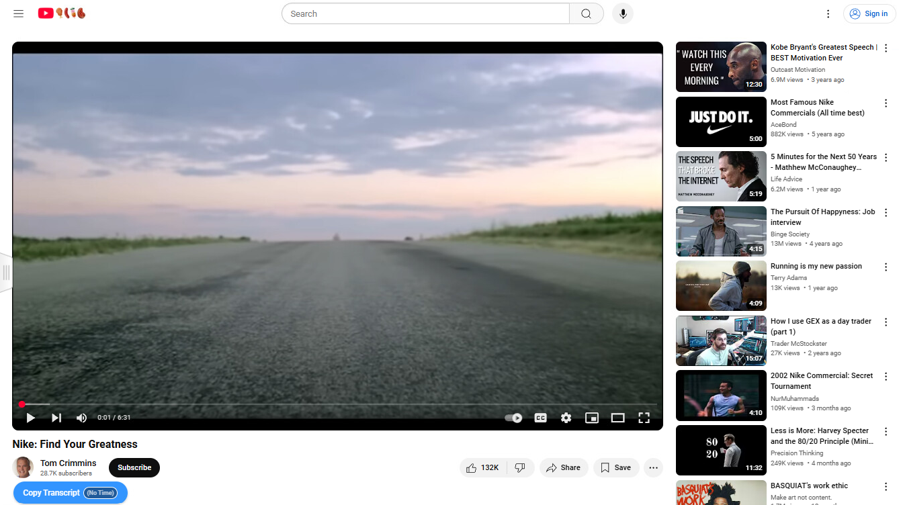
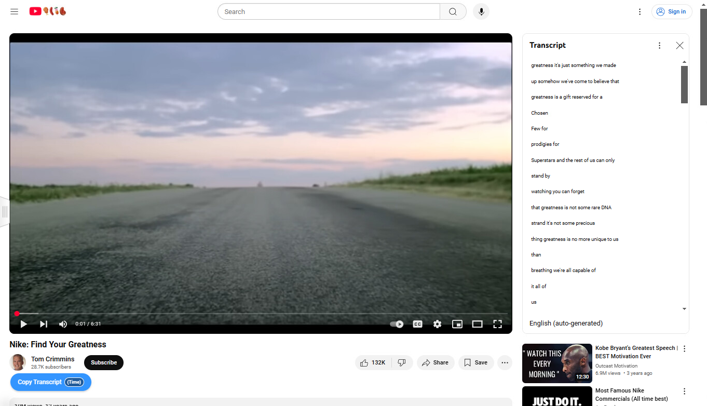
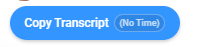
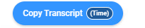
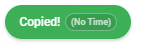
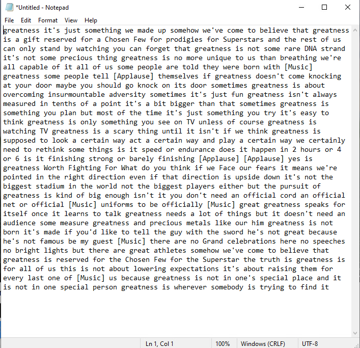
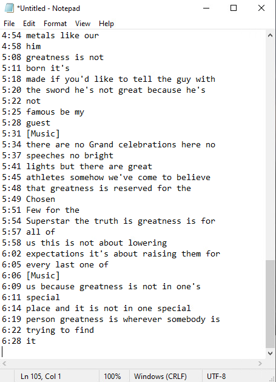

# Youtube-Transcript-Copier
A userscript that adds a button to YouTube video pages for copying the transcript with or without timestamps. It saves a few clicks. Instead of expanding the description, clicking the "Show Transcript" button and then toggling whether you want timestamps or not (by default, they are on), this userscript allows you to do everything via an button integrated into the Youtube page.

## Features

*   **One-Click Copy:** Copies the entire transcript to your clipboard with a single click.
*   **Timestamp Toggle:**  Choose whether to include timestamps or just the text.  The toggle is integrated directly into the button.
*   **Error Handling:**  Provides clear feedback if the transcript is not found or if there's an error during copying.

## Installation

1.  **Install a Userscript Manager:** Choose one of the following userscript managers based on your browser:

    **Tampermonkey:**

    *   Chrome: [Tampermonkey (Chrome Web Store)](https://chrome.google.com/webstore/detail/tampermonkey/dhdgffkkebhmkfjojejmpbldmpobfkfo)
    *   Firefox: [Tampermonkey (Firefox Add-ons)](https://addons.mozilla.org/en-US/firefox/addon/tampermonkey/)
    *   Microsoft Edge: [Tampermonkey (Microsoft Edge Add-ons)](https://microsoftedge.microsoft.com/addons/detail/tampermonkey/iikmkjmpaadaobahmlepeloendndfphd)
    *   Safari: [Tampermonkey (Mac App Store)](https://apps.apple.com/us/app/tampermonkey/id1482490089)  *Note: Requires macOS 10.13+*
    *   Opera: [Tampermonkey (Opera Add-ons)](https://addons.opera.com/en/extensions/details/tampermonkey-beta/)  *Note: Opera can also use chrome extensions (thus, you can use the Chrome Tampermonkey link if you prefer)*

    **Violentmonkey:**

    *   Chrome: [Violentmonkey (Chrome Web Store)](https://chrome.google.com/webstore/detail/violentmonkey/jinjaccalgkegednnccohejagnlnfdag)
    *   Firefox: [Violentmonkey (Firefox Add-ons)](https://addons.mozilla.org/en-US/firefox/addon/violentmonkey/)
    *   Microsoft Edge: [Violentmonkey (Microsoft Edge Add-ons)](https://microsoftedge.microsoft.com/addons/detail/violentmonkey/eeagobfjdenkkddmbclomhiblgggliao)

    **Greasemonkey:**  *(Firefox Only)*

    *   Firefox: [Greasemonkey (Firefox Add-ons)](https://addons.mozilla.org/en-US/firefox/addon/greasemonkey/)  *Note: Can also be installed on Android's Firefox.*

2.  **Install the Script:**

    *   Click [here](https://github.com/amirthfultehrani/Youtube-Transcript-Copier/raw/refs/heads/main/youtube-transcript-copier.user.js) to install the script from this repository.

## Usage

1.  Go to any YouTube video page.
2.  You should see a "Copy Transcript" button below the video, near the description.
3.  Click the "(No Time)" / "(Time)" portion of the button to toggle timestamps on or off.  The appearance of the toggle changes to reflect the current state.
4.  Click the main "Copy Transcript" part of the button to copy the transcript.  A brief "Copied!" message will confirm the action.

## Screenshots
**1. YouTube Interface - Button (No Time / Time):** Shows the "Copy Transcript" button as it appears on the YouTube video page, located beneath the video title (but above the description/comment section).  The button is a rounded, pill-shaped button with a blue background. The two states of the integrated timestamp toggle are demonstrated: the default "(No Time)" and the toggled "(Time)" state (achieved by clicking the timestamp portion of the button).

---

**2. Button Appearance - (No Time / Time):**  Shows a close-up of the "Copy Transcript" button, demonstrating both its default state (with the timestamp toggle displaying "(No Time)") and its toggled state (displaying "(Time)").

---

**3. Button - Copied! (No Time):** Shows the "Copy Transcript" button *after* it has been clicked and the transcript (without timestamps) has been successfully copied to the clipboard.  The button text changes to "Copied!" and the timestamp toggle remains in the "(No Time)" state. The button background changes to green to indicate success.

---

**4. Notepad - Transcript (No Time / Time):** Demonstrates the result of pasting the copied transcript text from the clipboard into a text editor (Notepad in this example). The two variations are displayed: one *without* timestamps (copied with "(No Time)" selected) and one *with* timestamps (copied with "(Time)" selected).  The text is already in the clipboard; Notepad is used to visualize the copied content.

## Contributing

Contributions are welcome! If you find a bug or have a feature request, please open an issue.  If you'd like to contribute code, please fork the repository and submit a pull request.

I hope this aids in your Youtubing endeavors!

## License

This project is licensed under the MIT License - see the [LICENSE](LICENSE) file for details.
